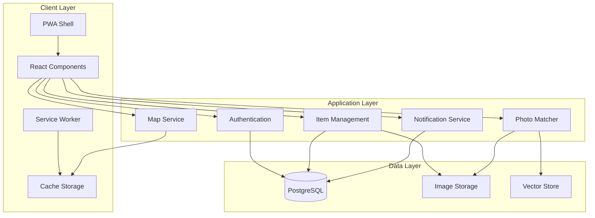

# Design Document: LyFind

## Overview

LyFind is a Progressive Web Application built on Next.js 16 with TypeScript, designed to help campus communities reunite lost items with their owners through intelligent matching. The application leverages modern web technologies including React 19, Tailwind CSS, and shadcn/ui components to deliver a mobile-first, responsive experience.

### Core Architecture Principles

1. **Mobile-First PWA**: Installable, offline-capable, with service worker caching
2. **AI-Powered Matching**: Computer vision for automatic lost/found item pairing
3. **Real-Time Updates**: Instant notifications for matches and messages
4. **Scalable Design**: Modular architecture supporting growth
5. **Privacy-Focused**: Secure data handling with user control

### Technology Stack

- **Frontend**: Next.js 16 (App Router), React 19, TypeScript
- **Styling**: Tailwind CSS, shadcn/ui components
- **State Management**: React hooks, Context API
- **PWA**: next-pwa, Workbox for service workers
- **Maps**: Leaflet with OpenStreetMap (free, no API keys required)
- **AI/ML**: TensorFlow.js with MobileNet for client-side image analysis
- **Storage**: Cloud storage (AWS S3 or Cloudflare R2) for images
- **Database**: PostgreSQL with Prisma ORM
- **Authentication**: NextAuth.js with multiple providers
- **Real-Time**: Server-Sent Events (SSE) or WebSockets for notifications

## Architecture

### System Components




### Layer Responsibilities

**Client Layer**:
- PWA Shell: App manifest, install prompts, offline detection
- React Components: UI rendering, user interactions, form handling
- Service Worker: Asset caching, offline support, background sync
- Cache Storage: Cached pages, images, map tiles, API responses

**Application Layer**:
- Authentication: User sign-up, sign-in, session management
- Item Management: CRUD operations for lost/found items
- Photo Matcher: Image feature extraction, similarity comparison
- Map Service: Location selection, marker rendering, geocoding
- Notification Service: Match alerts, message notifications, push notifications

**Data Layer**:
- PostgreSQL: User accounts, item posts, messages, notifications
- Image Storage: Original and compressed photos, thumbnails
- Vector Store: Image embeddings for similarity search

## Components and Interfaces

### 1. Authentication Module

**Purpose**: Manage user authentication and authorization using NextAuth.js

**Key Components**:
- `AuthProvider`: React context for authentication state
- `SignInForm`: Email/password and OAuth sign-in
- `SignUpForm`: New user registration
- `ProtectedRoute`: HOC for route protection

**Interface**:
```typescript
interface User {
  id: string;
  email: string;
  name: string;
  createdAt: Date;
  avatarUrl?: string;
}

interface AuthContext {
  user: User | null;
  isLoading: boolean;
  signIn: (email: string, password: string) => Promise<void>;
  signUp: (email: string, password: string, name: string) => Promise<void>;
  signOut: () => Promise<void>;
}
```

### 2. Item Management Module

**Purpose**: Handle creation, editing, and display of lost/found items

**Key Components**:
- `ItemPostForm`: Form for creating/editing items
- `ItemCard`: Display item in list view
- `ItemDetail`: Full item view with photos and map
- `ItemList`: Paginated list with filters
- `PhotoUploader`: Multi-photo upload with preview

**Interface**:
```typescript
interface ItemPost {
  id: string;
  type: 'lost' | 'found';
  title: string;
  description: string;
  category: ItemCategory;
  photos: Photo[];
  location: Location;
  contactInfo?: ContactInfo;
  status: 'active' | 'resolved' | 'archived';
  userId: string;
  createdAt: Date;
  updatedAt: Date;
}

interface Photo {
  id: string;
  url: string;
  thumbnailUrl: string;
  embedding?: number[]; // Feature vector for matching
}

interface Location {
  lat: number;
  lng: number;
  address?: string;
  buildingName?: string;
}

type ItemCategory = 
  | 'electronics'
  | 'clothing'
  | 'accessories'
  | 'books'
  | 'keys'
  | 'bags'
  | 'other';
```

### 3. Photo Matching Module

**Purpose**: AI-powered visual similarity matching using TensorFlow.js

**Research Findings**:
- **TensorFlow.js with MobileNet**: Pre-trained model for feature extraction, runs in browser
- **Cosine Similarity**: Compare feature vectors to compute match scores
- **Client-Side Processing**: Privacy-preserving, no server-side image analysis needed
- **Performance**: ~200-500ms per image on modern devices

**Key Components**:
- `PhotoMatcher`: Core matching engine
- `FeatureExtractor`: Extract embeddings from images using MobileNet
- `SimilarityCalculator`: Compute cosine similarity between embeddings
- `MatchSuggester`: Generate and rank match suggestions

**Interface**:
```typescript
interface PhotoMatcher {
  extractFeatures(imageUrl: string): Promise<number[]>;
  findMatches(embedding: number[], type: 'lost' | 'found'): Promise<Match[]>;
  computeSimilarity(embedding1: number[], embedding2: number[]): number;
}

interface Match {
  itemId: string;
  score: number; // 0-100
  item: ItemPost;
}

interface MatchSuggestion {
  id: string;
  lostItemId: string;
  foundItemId: string;
  score: number;
  createdAt: Date;
  viewedByLostOwner: boolean;
  viewedByFoundOwner: boolean;
}
```

**Matching Algorithm**:
1. When item is posted, extract features from all photos using MobileNet
2. Store feature vectors (embeddings) in database
3. Compare new item's embeddings against opposite type items
4. Calculate cosine similarity for each comparison
5. Generate match suggestions for scores > 70
6. Rank suggestions by score and recency

### 4. Campus Map Module

**Purpose**: Interactive map for location selection and visualization

**Research Findings**:
- **Leaflet**: Lightweight, mobile-friendly, no API keys required
- **OpenStreetMap**: Free tile provider, good campus coverage
- **Offline Support**: Cache tiles in service worker for offline viewing
- **React-Leaflet**: React wrapper for Leaflet integration

**Key Components**:
- `CampusMap`: Main map component with markers
- `LocationPicker`: Interactive location selection
- `MapMarker`: Custom marker for items
- `MapCluster`: Cluster nearby markers for performance

**Interface**:
```typescript
interface MapProps {
  center: [number, number];
  zoom: number;
  markers: MapMarker[];
  onLocationSelect?: (location: Location) => void;
  interactive?: boolean;
}

interface MapMarker {
  id: string;
  position: [number, number];
  type: 'lost' | 'found';
  item: ItemPost;
}
```

### 5. Notification Module

**Purpose**: Real-time notifications for matches and messages

**Key Components**:
- `NotificationProvider`: Context for notification state
- `NotificationBell`: UI indicator with unread count
- `NotificationList`: List of all notifications
- `PushNotificationManager`: Handle push notification permissions

**Interface**:
```typescript
interface Notification {
  id: string;
  userId: string;
  type: 'match' | 'message' | 'system';
  title: string;
  message: string;
  itemId?: string;
  matchId?: string;
  read: boolean;
  createdAt: Date;
}

interface NotificationService {
  subscribe(userId: string): void;
  unsubscribe(): void;
  markAsRead(notificationId: string): Promise<void>;
  requestPushPermission(): Promise<boolean>;
}
```

### 6. PWA Module

**Purpose**: Progressive Web App functionality with offline support

**Key Components**:
- `PWAInstallPrompt`: Install banner/prompt
- `OfflineIndicator`: Show connection status
- `SyncManager`: Background sync for offline actions
- Service Worker: Asset caching, offline pages, background sync

**PWA Configuration**:
```typescript
// next.config.js with next-pwa
const withPWA = require('next-pwa')({
  dest: 'public',
  register: true,
  skipWaiting: true,
  disable: process.env.NODE_ENV === 'development',
  runtimeCaching: [
    {
      urlPattern: /^https:\/\/.*\.(?:png|jpg|jpeg|svg|gif|webp)$/,
      handler: 'CacheFirst',
      options: {
        cacheName: 'images',
        expiration: {
          maxEntries: 100,
          maxAgeSeconds: 30 * 24 * 60 * 60, // 30 days
        },
      },
    },
    {
      urlPattern: /^https:\/\/.*\.(?:json)$/,
      handler: 'NetworkFirst',
      options: {
        cacheName: 'api',
        expiration: {
          maxEntries: 50,
          maxAgeSeconds: 5 * 60, // 5 minutes
        },
      },
    },
  ],
});
```

**Manifest**:
```json
{
  "name": "LyFind - Lost and Found",
  "short_name": "LyFind",
  "description": "Campus lost and found with AI matching",
  "start_url": "/",
  "display": "standalone",
  "background_color": "#ffffff",
  "theme_color": "#3b82f6",
  "icons": [
    {
      "src": "/icon-192.png",
      "sizes": "192x192",
      "type": "image/png"
    },
    {
      "src": "/icon-512.png",
      "sizes": "512x512",
      "type": "image/png"
    }
  ]
}
```

### 7. Messaging Module

**Purpose**: User-to-user communication about items

**Key Components**:
- `MessageThread`: Conversation view
- `MessageList`: List of conversations
- `MessageComposer`: Send new messages
- `MessageNotifier`: Real-time message notifications

**Interface**:
```typescript
interface Message {
  id: string;
  threadId: string;
  senderId: string;
  recipientId: string;
  content: string;
  itemId?: string;
  read: boolean;
  createdAt: Date;
}

interface MessageThread {
  id: string;
  participants: string[];
  itemId?: string;
  lastMessage: Message;
  unreadCount: number;
  createdAt: Date;
}
```

## Data Models

### Database Schema (Prisma)

```prisma
model User {
  id            String    @id @default(cuid())
  email         String    @unique
  name          String
  passwordHash  String
  avatarUrl     String?
  createdAt     DateTime  @default(now())
  updatedAt     DateTime  @updatedAt
  
  items         Item[]
  messages      Message[]
  notifications Notification[]
  
  @@index([email])
}

model Item {
  id            String      @id @default(cuid())
  type          ItemType
  title         String
  description   String
  category      ItemCategory
  status        ItemStatus  @default(ACTIVE)
  locationLat   Float
  locationLng   Float
  locationAddr  String?
  contactEmail  String?
  contactPhone  String?
  userId        String
  createdAt     DateTime    @default(now())
  updatedAt     DateTime    @updatedAt
  
  user          User        @relation(fields: [userId], references: [id])
  photos        Photo[]
  matchesAsLost Match[]     @relation("LostItem")
  matchesAsFound Match[]    @relation("FoundItem")
  
  @@index([type, status, createdAt])
  @@index([category])
  @@index([userId])
}

model Photo {
  id            String   @id @default(cuid())
  itemId        String
  url           String
  thumbnailUrl  String
  embedding     Float[]  // Feature vector for matching
  createdAt     DateTime @default(now())
  
  item          Item     @relation(fields: [itemId], references: [id], onDelete: Cascade)
  
  @@index([itemId])
}

model Match {
  id            String   @id @default(cuid())
  lostItemId    String
  foundItemId   String
  score         Float
  viewedByLost  Boolean  @default(false)
  viewedByFound Boolean  @default(false)
  createdAt     DateTime @default(now())
  
  lostItem      Item     @relation("LostItem", fields: [lostItemId], references: [id], onDelete: Cascade)
  foundItem     Item     @relation("FoundItem", fields: [foundItemId], references: [id], onDelete: Cascade)
  
  @@unique([lostItemId, foundItemId])
  @@index([lostItemId, score])
  @@index([foundItemId, score])
}

model Message {
  id            String   @id @default(cuid())
  threadId      String
  senderId      String
  recipientId   String
  content       String
  itemId        String?
  read          Boolean  @default(false)
  createdAt     DateTime @default(now())
  
  sender        User     @relation(fields: [senderId], references: [id])
  
  @@index([threadId, createdAt])
  @@index([recipientId, read])
}

model Notification {
  id            String           @id @default(cuid())
  userId        String
  type          NotificationType
  title         String
  message       String
  itemId        String?
  matchId       String?
  read          Boolean          @default(false)
  createdAt     DateTime         @default(now())
  
  user          User             @relation(fields: [userId], references: [id])
  
  @@index([userId, read, createdAt])
}

enum ItemType {
  LOST
  FOUND
}

enum ItemCategory {
  ELECTRONICS
  CLOTHING
  ACCESSORIES
  BOOKS
  KEYS
  BAGS
  OTHER
}

enum ItemStatus {
  ACTIVE
  RESOLVED
  ARCHIVED
}

enum NotificationType {
  MATCH
  MESSAGE
  SYSTEM
}
```

### API Routes (Next.js App Router)

**Authentication**:
- `POST /api/auth/signup` - Create new user account
- `POST /api/auth/signin` - Authenticate user
- `POST /api/auth/signout` - End user session

**Items**:
- `GET /api/items` - List items with filters (type, category, search)
- `GET /api/items/[id]` - Get item details
- `POST /api/items` - Create new item
- `PATCH /api/items/[id]` - Update item
- `DELETE /api/items/[id]` - Delete item
- `GET /api/items/[id]/matches` - Get match suggestions for item

**Photos**:
- `POST /api/photos/upload` - Upload photo, return URL
- `POST /api/photos/extract-features` - Extract embeddings from photo
- `DELETE /api/photos/[id]` - Delete photo

**Matches**:
- `POST /api/matches/find` - Find matches for item
- `GET /api/matches/[id]` - Get match details
- `PATCH /api/matches/[id]/view` - Mark match as viewed

**Messages**:
- `GET /api/messages` - List message threads
- `GET /api/messages/[threadId]` - Get messages in thread
- `POST /api/messages` - Send new message
- `PATCH /api/messages/[id]/read` - Mark message as read

**Notifications**:
- `GET /api/notifications` - List user notifications
- `PATCH /api/notifications/[id]/read` - Mark notification as read
- `POST /api/notifications/subscribe` - Subscribe to push notifications


## Correctness Properties

*A property is a characteristic or behavior that should hold true across all valid executions of a system—essentially, a formal statement about what the system should do. Properties serve as the bridge between human-readable specifications and machine-verifiable correctness guarantees.*

### Authentication Properties

**Property 1: Valid credentials create authenticated sessions**
*For any* valid email and password combination, when a user signs up or signs in, the system should create an authenticated session and grant access to protected features.
**Validates: Requirements 1.2, 1.3**

**Property 2: Invalid credentials are rejected**
*For any* invalid credentials (wrong password, non-existent email, malformed input), authentication attempts should be rejected with descriptive error messages.
**Validates: Requirements 1.4**

**Property 3: Profile displays user data**
*For any* authenticated user, accessing their profile should display their account information and all their posted items.
**Validates: Requirements 1.5**

**Property 4: Logout terminates sessions**
*For any* authenticated user, logging out should terminate their session and prevent access to protected features.
**Validates: Requirements 1.6**

### Item Posting Properties

**Property 5: Item posts require mandatory fields**
*For any* item post (lost or found), the system should reject posts missing required fields (title, description, category, or photos) and accept posts with all required fields.
**Validates: Requirements 2.1, 3.1**

**Property 6: Photo upload validation**
*For any* uploaded file, the system should accept valid image formats (JPEG, PNG, WebP) under 10MB and reject invalid formats or oversized files.
**Validates: Requirements 2.2, 3.2**

**Property 7: Location storage**
*For any* selected location coordinates, when a user creates an item post, the system should store the exact coordinates with the item.
**Validates: Requirements 2.3, 3.3**

**Property 8: Post submission triggers matching**
*For any* valid item post submission, the system should save the post, timestamp it, and trigger the photo matcher to find potential matches.
**Validates: Requirements 2.4, 2.5, 3.4, 3.5**

**Property 9: Optional contact information storage**
*For any* item post with optional contact information provided, the system should store it securely and make it retrievable only to authorized users.
**Validates: Requirements 2.6, 3.6**

### Browsing and Search Properties

**Property 10: Browse displays items in reverse chronological order**
*For any* set of active items, the browse page should display them ordered by creation date with newest first.
**Validates: Requirements 4.1**

**Property 11: Filtering returns matching items only**
*For any* filter criteria (category, type, or keyword), the system should return only items that match the criteria and exclude all non-matching items.
**Validates: Requirements 4.2, 4.3, 4.4**

**Property 12: Item detail displays complete information**
*For any* item, the detail page should display all item information including photos, description, location, timestamp, and any match suggestions.
**Validates: Requirements 4.5, 4.6**

### Photo Matching Properties

**Property 13: Feature extraction from photos**
*For any* uploaded photo, the photo matcher should extract a feature vector (embedding) that can be used for similarity comparison.
**Validates: Requirements 5.1**

**Property 14: Bidirectional matching**
*For any* new item post, the photo matcher should compare it against all opposite-type items (lost vs found, found vs lost) and generate match scores for each comparison.
**Validates: Requirements 5.2, 5.3**

**Property 15: High-confidence matches create suggestions**
*For any* item pair with a match score exceeding 70, the system should create a match suggestion and send notifications to both item owners.
**Validates: Requirements 5.4, 5.5**

**Property 16: Match suggestions ranked by score**
*For any* item with multiple match suggestions, viewing the item should display all suggestions ranked by match score in descending order.
**Validates: Requirements 5.6**

### Map Integration Properties

**Property 17: Map marker displays item location**
*For any* item with location coordinates, the map should display a marker at the exact coordinates when viewing the item detail or browse map view.
**Validates: Requirements 6.2, 6.3**

**Property 18: Marker interaction shows item preview**
*For any* map marker, clicking it should display a preview of the associated item post.
**Validates: Requirements 6.4**

**Property 19: Offline map displays cached tiles**
*For any* previously viewed map area, when the user is offline, the map should display cached tiles for that area.
**Validates: Requirements 6.6**

### Communication Properties

**Property 20: Contact button visibility**
*For any* item post, the contact button should be visible if and only if the item owner provided contact information.
**Validates: Requirements 7.1**

**Property 21: Contact information access control**
*For any* item with contact information, clicking the contact button should display the owner's contact method only to authenticated users.
**Validates: Requirements 7.2**

**Property 22: Match enables messaging**
*For any* match suggestion between two items, both item owners should be able to send direct messages to each other.
**Validates: Requirements 7.3**

**Property 23: Message delivery and notification**
*For any* sent message, the system should deliver it to the recipient, send a notification, and display an unread indicator until viewed.
**Validates: Requirements 7.4, 7.5**

**Property 24: Resolution archives conversations**
*For any* item marked as resolved, the system should change its status, remove it from active listings, and archive associated conversations.
**Validates: Requirements 7.6**

### PWA Properties

**Property 25: Service worker caches assets**
*For any* PWA installation, the service worker should cache essential assets enabling offline access to previously loaded content.
**Validates: Requirements 8.2, 8.3**

**Property 26: Offline creation with background sync**
*For any* item created while offline, the system should queue it locally and sync it to the server when connectivity is restored.
**Validates: Requirements 8.4, 8.5**

### Photo Storage Properties

**Property 27: Photo compression and thumbnail generation**
*For any* valid uploaded photo, the system should compress it while maintaining quality and generate a thumbnail version.
**Validates: Requirements 9.2, 9.3**

**Property 28: Photo upload limits**
*For any* item post, the system should accept up to 5 photos and reject attempts to upload more than 5 photos.
**Validates: Requirements 9.4**

**Property 29: Photo storage generates unique identifiers**
*For any* stored photo, the system should generate a unique identifier and secure URL that can be used to retrieve the photo.
**Validates: Requirements 9.5**

**Property 30: Cascading photo deletion**
*For any* deleted item post, the system should remove all associated photos from storage.
**Validates: Requirements 9.6**

### Notification Properties

**Property 31: Events trigger notifications**
*For any* significant event (match creation, message receipt), the system should create and send a notification to the affected user.
**Validates: Requirements 10.1, 10.2**

**Property 32: Notification read status**
*For any* notification, viewing it should mark it as read and remove the unread indicator.
**Validates: Requirements 10.4**

**Property 33: Notifications display in reverse chronological order**
*For any* user's notifications, the notifications page should display them ordered by creation date with newest first.
**Validates: Requirements 10.5**

**Property 34: Notification navigation**
*For any* notification, clicking it should navigate to the relevant item post or message thread.
**Validates: Requirements 10.6**

### Item Management Properties

**Property 35: Ownership controls visibility**
*For any* item post, edit and delete options should be visible if and only if the current user is the item owner.
**Validates: Requirements 11.1**

**Property 36: Item editing updates and re-triggers matching**
*For any* item edit that changes photos, the system should save the changes and re-trigger the photo matcher to find new potential matches.
**Validates: Requirements 11.2, 11.3**

**Property 37: Status changes affect listing visibility**
*For any* item marked as resolved, the system should change its status and exclude it from active listings while keeping it in the owner's profile.
**Validates: Requirements 11.4, 11.6**

**Property 38: Item deletion removes all associated data**
*For any* deleted item, the system should permanently remove the item post, photos, match suggestions, and associated data.
**Validates: Requirements 11.5**

### Responsive Design Properties

**Property 39: Layout adapts to viewport size**
*For any* viewport size (mobile, tablet, desktop), the system should display an appropriate layout optimized for that screen size with all functionality accessible.
**Validates: Requirements 12.1, 12.2, 12.3**

### Security Properties

**Property 40: Password hashing**
*For any* user account, the system should store passwords as hashed values using industry-standard algorithms, never storing plaintext passwords.
**Validates: Requirements 13.1**

**Property 41: Contact information access control**
*For any* item with contact information, unauthenticated users should not be able to access the contact details.
**Validates: Requirements 13.3**

**Property 42: Account deletion anonymizes data**
*For any* deleted user account, the system should remove all personal information while keeping item posts anonymized for historical purposes.
**Validates: Requirements 13.4**

**Property 43: Rate limiting prevents abuse**
*For any* API endpoint, making requests at a rate exceeding the limit should result in rate limit errors.
**Validates: Requirements 13.5**

**Property 44: Image data retention**
*For any* processed image, the photo matcher should not retain raw image data beyond the specified retention period.
**Validates: Requirements 13.6**

### Performance Properties

**Property 45: Client-side routing for navigation**
*For any* navigation between pages, the system should use client-side routing without full page reloads.
**Validates: Requirements 14.2**

**Property 46: Lazy loading for item listings**
*For any* long list of items, scrolling should trigger incremental loading of additional items rather than loading all items at once.
**Validates: Requirements 14.3**

**Property 47: Progressive image loading**
*For any* item with photos, thumbnail images should load and display before full-resolution images.
**Validates: Requirements 14.4**

## Error Handling

### Client-Side Error Handling

**Form Validation Errors**:
- Display inline validation messages for invalid inputs
- Prevent form submission until all validation passes
- Highlight fields with errors using visual indicators

**Network Errors**:
- Detect offline state and display offline indicator
- Queue actions for background sync when offline
- Show retry options for failed requests
- Display user-friendly error messages for API failures

**Photo Upload Errors**:
- Validate file type and size before upload
- Display progress indicators during upload
- Handle upload failures with retry options
- Show clear error messages for rejected files

**Map Errors**:
- Handle geolocation permission denials gracefully
- Fall back to default campus location if geolocation fails
- Display error messages for map tile loading failures
- Provide manual location selection if automatic fails

### Server-Side Error Handling

**Authentication Errors**:
- Return 401 for unauthenticated requests
- Return 403 for unauthorized access attempts
- Provide descriptive error messages for failed authentication
- Implement account lockout after repeated failed attempts

**Validation Errors**:
- Return 400 with detailed validation error messages
- Validate all inputs on server side regardless of client validation
- Sanitize inputs to prevent injection attacks
- Return specific error codes for different validation failures

**Resource Errors**:
- Return 404 for non-existent resources
- Return 409 for conflict errors (e.g., duplicate entries)
- Return 410 for deleted resources
- Provide helpful error messages guiding users to resolution

**Server Errors**:
- Return 500 for unexpected server errors
- Log all server errors for debugging
- Display generic error messages to users (don't expose internals)
- Implement automatic retry with exponential backoff for transient failures

**Rate Limiting**:
- Return 429 when rate limit exceeded
- Include Retry-After header indicating when to retry
- Implement different rate limits for different endpoints
- Allow higher limits for authenticated users

### Photo Matching Error Handling

**Feature Extraction Failures**:
- Retry extraction up to 3 times with exponential backoff
- Fall back to manual matching if extraction fails
- Log failures for monitoring and debugging
- Notify user if matching is unavailable

**Similarity Computation Errors**:
- Handle missing or corrupted embeddings gracefully
- Skip invalid comparisons and continue with valid ones
- Log errors for investigation
- Don't block item posting if matching fails

**Timeout Handling**:
- Set 30-second timeout for feature extraction
- Cancel long-running operations and retry
- Provide feedback to user if processing takes too long
- Queue for background processing if immediate processing fails

## Testing Strategy

### Dual Testing Approach

LyFind will employ both unit testing and property-based testing to ensure comprehensive coverage:

**Unit Tests**: Focus on specific examples, edge cases, and integration points
- Specific user flows (sign up, post item, view matches)
- Edge cases (empty inputs, boundary values, special characters)
- Error conditions (network failures, invalid data, permission denials)
- Component integration (form submission, API calls, state updates)

**Property-Based Tests**: Verify universal properties across all inputs
- Generate random valid/invalid inputs to test validation
- Test properties with many randomized scenarios (100+ iterations)
- Verify invariants hold across all executions
- Catch edge cases that manual test cases might miss

### Testing Tools

**Unit Testing**:
- **Framework**: Vitest (fast, modern, TypeScript support)
- **React Testing**: React Testing Library
- **E2E Testing**: Playwright for critical user flows
- **API Testing**: Supertest for API endpoint testing

**Property-Based Testing**:
- **Framework**: fast-check (JavaScript/TypeScript property-based testing)
- **Configuration**: Minimum 100 iterations per property test
- **Tagging**: Each property test references its design document property

### Property Test Configuration

Each property-based test must:
1. Run minimum 100 iterations with randomized inputs
2. Include a comment tag referencing the design property
3. Use appropriate generators for the data types being tested
4. Verify the property holds for all generated inputs

**Tag Format**:
```typescript
// Feature: lyfind, Property 5: Item posts require mandatory fields
test('item posts require all mandatory fields', () => {
  fc.assert(
    fc.property(
      fc.record({
        title: fc.string(),
        description: fc.string(),
        category: fc.constantFrom('electronics', 'clothing', 'accessories'),
        photos: fc.array(fc.string(), { minLength: 1 })
      }),
      (validPost) => {
        // Test that valid posts are accepted
        expect(validateItemPost(validPost)).toBe(true);
      }
    ),
    { numRuns: 100 }
  );
});
```

### Test Coverage Goals

- **Unit Test Coverage**: Minimum 80% code coverage
- **Property Test Coverage**: All 47 correctness properties implemented
- **E2E Test Coverage**: Critical user flows (auth, post item, view matches, messaging)
- **Integration Test Coverage**: All API endpoints
- **PWA Test Coverage**: Offline functionality, caching, background sync

### Testing Priorities

**High Priority** (Must test before launch):
1. Authentication and authorization
2. Item posting and photo upload
3. Photo matching accuracy
4. Data privacy and security
5. PWA offline functionality

**Medium Priority** (Should test before launch):
1. Search and filtering
2. Map integration
3. Messaging and notifications
4. Item management (edit, delete, resolve)
5. Responsive design

**Low Priority** (Can test post-launch):
1. Performance optimizations
2. Advanced filtering options
3. UI polish and animations
4. Analytics and monitoring

### Continuous Integration

- Run all tests on every pull request
- Block merges if tests fail
- Run property tests with increased iterations (1000+) nightly
- Monitor test execution time and optimize slow tests
- Generate coverage reports and track trends

